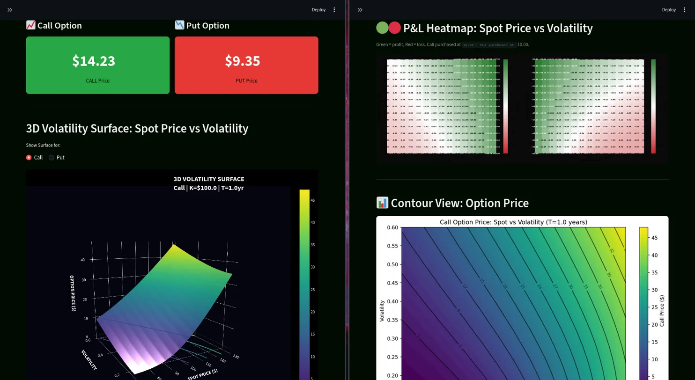

# Options Pricing and Volatility Surface Analyzer

A financial derivatives pricing tool built with Python and Streamlit in FALL 2025. This project implements two core option pricing models, Black-Scholes and Monte Carlo simulation, and visualizes how option prices and P&L change across different market scenarios.

I built this independently outside of coursework after taking a Derivatives Securities Pricing course. The goal was to deepen my understanding of the models we studied and to build something concrete I could show my professor



---

## What It Does

The app takes the standard inputs to an options pricing model and outputs both call and put prices in real time as you adjust the parameters.

Beyond just pricing, it generates:

- A 3D volatility surface showing how the option price changes across a grid of spot prices and implied volatilities
- A P&L heatmap that shows your profit or loss across every scenario given a purchase price you specify
- Monte Carlo simulation paths showing the distribution of possible underlying price trajectories
- A SQLite database that logs every calculation you save, structured across two normalized tables

---

## Pricing Models

### Black-Scholes

The closed-form solution to the Black-Scholes PDE under the assumption of constant volatility and log-normally distributed returns. The implementation includes a continuous dividend yield adjustment via the cost-of-carry term.

A European call is priced as:

$$C = S \cdot N(d_1) - K e^{-rT} \cdot N(d_2)$$

$$d_1 = \frac{\ln(S/K) + (r - q + \frac{1}{2}\sigma^2)T}{\sigma\sqrt{T}}$$

$$d_2 = d_1 - \sigma\sqrt{T}$$

where:
- $S$ = spot price
- $K$ = strike price
- $T$ = time to expiry in years
- $r$ = risk-free rate
- $q$ = continuous dividend yield
- $\sigma$ = implied volatility
- $N(\cdot)$ = standard normal CDF

The put price follows from put-call parity:

$$P = K e^{-rT} \cdot N(-d_2) - S \cdot N(-d_1)$$

### Monte Carlo

Simulates $N$ paths of the underlying asset using Geometric Brownian Motion under the risk-neutral measure:

$$S_{t} = S_{t-1} \cdot \exp\!\left[\left(r - q - \frac{1}{2}\sigma^2\right)h + \sigma\sqrt{h}\, Z\right]$$

where $Z \sim \mathcal{N}(0,1)$ and $h = T / \text{steps}$ is the time step size.

The option price is the discounted expected payoff across all $N$ paths:

$$C = e^{-rT} \cdot \frac{1}{N} \sum_{i=1}^{N} \max(S_T^{(i)} - K,\ 0)$$

$$P = e^{-rT} \cdot \frac{1}{N} \sum_{i=1}^{N} \max(K - S_T^{(i)},\ 0)$$

More paths give a more accurate estimate at the cost of computation time. By the law of large numbers the Monte Carlo price converges to the Black-Scholes price as $N \to \infty$.

---

## P&L Heatmap

This is the most practically useful feature. You input a purchase price for both the call and the put, and the heatmap shows your P&L across a grid of spot and volatility scenarios:

$$\text{P\&L} = V(\sigma', S') - V_0$$

where $V(\sigma', S')$ is the model value at the shocked scenario and $V_0$ is your purchase price.

Green cells are profitable scenarios, red cells are losing scenarios. The colormap is centered at zero so breakeven is always white. This lets you immediately see your directional exposure and vol exposure at a glance.

---

## Database Schema

Every calculation can be saved to a local SQLite database. The schema follows a normalized two-table design:

**inputs table** stores one row per calculation with all base parameters and a UUID as the primary key.

```sql
CREATE TABLE inputs (
    calc_id       TEXT PRIMARY KEY,
    timestamp     TEXT,
    spot          REAL,
    strike        REAL,
    expiry        REAL,
    rate          REAL,
    volatility    REAL,
    dividend      REAL,
    call_price    REAL,
    put_price     REAL,
    call_purchase REAL,
    put_purchase  REAL
)
```

**outputs table** stores one row per heatmap cell (225 rows for a 15x15 grid), linked back to the parent calculation via `calc_id`.

```sql
CREATE TABLE outputs (
    output_id  INTEGER PRIMARY KEY AUTOINCREMENT,
    calc_id    TEXT,
    spot_shock REAL,
    vol_shock  REAL,
    call_value REAL,
    put_value  REAL,
    call_pnl   REAL,
    put_pnl    REAL,
    FOREIGN KEY (calc_id) REFERENCES inputs(calc_id)
)
```

Shocks are stored as deltas from the base scenario rather than absolute values. This makes it easier to compare sensitivity across different base scenarios and is closer to how risk systems actually store scenario data in practice.

SQLite was used for portability and zero setup. The schema is identical to what you would deploy with PostgreSQL or MySQL in a production environment.

---

## How to Run

```bash
git clone https://github.com/yourusername/options-pricer
cd options-pricer

python -m venv myvenv
source myvenv/bin/activate

pip install -r requirements.txt

streamlit run app.py
```

The database file `options_log.db` is created automatically in the project directory on first run.

---

## Project Structure

```
options-pricer/
├── app.py               # Main application
├── options_log.db       # SQLite database (auto-generated)
├── requirements.txt
├── assets/
│   └── screenshot.png
└── README.md
```

---

## What I Would Add Next

- **Greeks** — delta $\Delta$, gamma $\Gamma$, vega $\nu$, theta $\Theta$ computed analytically for Black-Scholes and via finite differences for Monte Carlo
- **Implied volatility solver** using Brent's method to back out $\sigma_{imp}$ from a market price, which would make the surface reflect real market-observed skew rather than a flat vol assumption
- **Volatility smile visualization** by plotting $\sigma_{imp}$ against strike $K$ for a fixed expiry $T$
- **Historical data integration** via yfinance to price options on real tickers with real market inputs

---

## References

- Black, F. and Scholes, M. (1973). The Pricing of Options and Corporate Liabilities. *Journal of Political Economy*.
- Hull, J. (2022). *Options, Futures, and Other Derivatives*.
- Natenberg, S. (1994). *Option Volatility and Pricing*.
